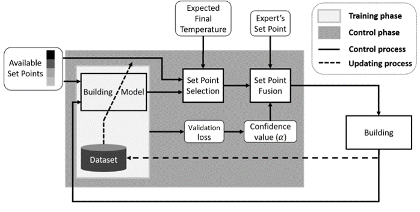
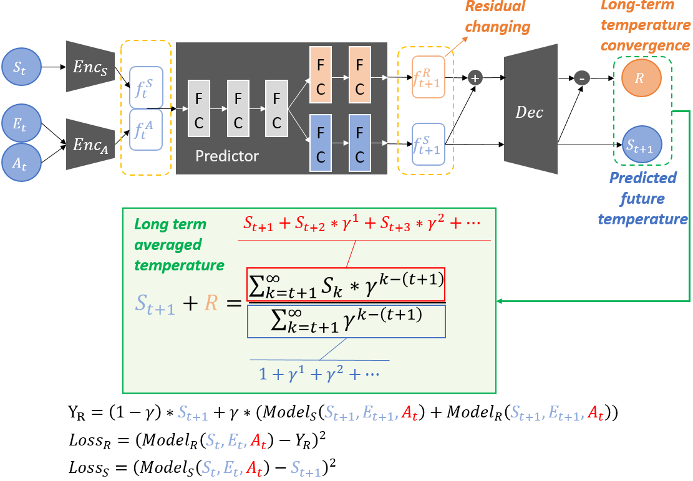
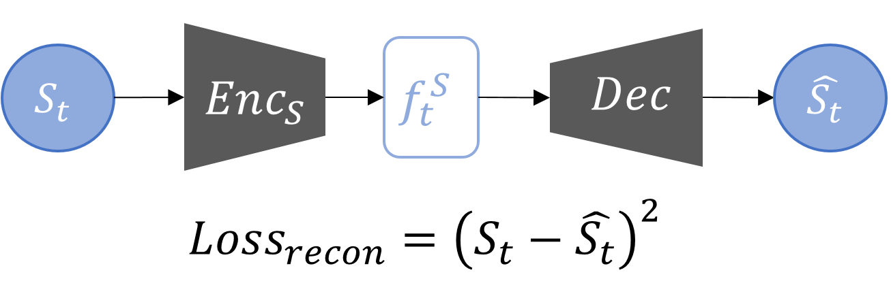
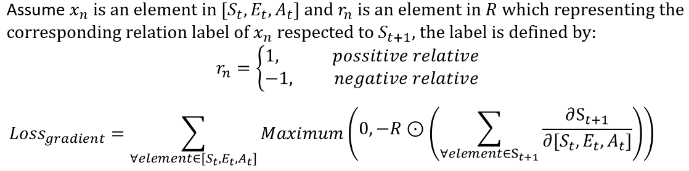
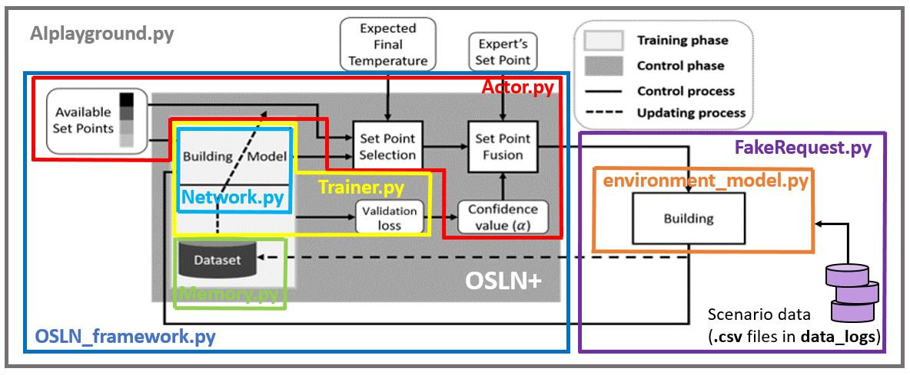

# Online Self-Learning For Smart HVAC Control
This is the upgrade version of our publication <a href="https://ieeexplore.ieee.org/document/8914027">Online Self-Learning For Smart HVAC Control</a>, named OSLN+. 
 

Compared with our old version published in IEEE SMC 2019, there are three majior difference in OSLN+: 

1. OSLN+ is designed as an auto-encoder form with a latent predictor. Considering there are different sensor combinations in different target offices, this design increase the extensive ability so that it is possible to share/transfer the latent predictor in future research. (i.e., the encoder/decoder can be viewed as the "domain converter" if we apply transfer learning or meta-learning for OSLN+ in future research; each domain has its specifical encoder/decoder but shares the latent predictor.) 
 

2. To prevent the setpoint from changing extremely and frequently, OSLN+ additionally learns to predict the long-term temperature convergence tendency for representing the stability of the corresponding setpoint.  
 
3. Moreover, to better regularize the network during learning with limited data samples, we design a novel constraint loss to guide the physical prior for the network. We penalize the network when it predicts the future temperature using the wrong assumption that violates the physical rule (e.g., when the network considers the AHU temperature setpoint is negative related to the output predicted future temperature, it gets a loss value from such constraint.)  
 

## About the code
The code simulates the control process of OSLN+ in the real-world environment using an NN-based environment model trained with dataset collected from a large scale office. For executing the control simulation, please run this file. With the default setting, the record file will appear in experimental_record. 
 

## Requirement
-pandas 1.3.5 
-torch 1.11.0 

