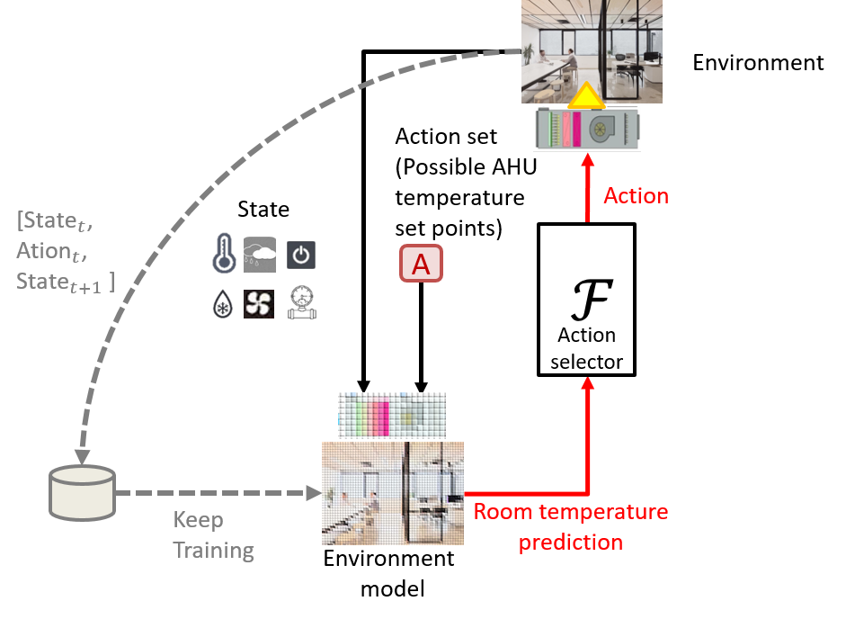

# Online Self-Learning For Smart HVAC Control
This is the upgrade version of OSLN <a href="https://ieeexplore.ieee.org/document/8914027">Online Self-Learning For Smart HVAC Control</a>, named OSLN+.  
Comparing with our old version published in IEEE SMC 2019, OSLN+ 
The code simulates the control process of OSLN+ in the real-world environment using an NN-based environment model trained with dataset collected from a large scale office.

# Online Self-Learning For Smart HVAC Control

 
 

